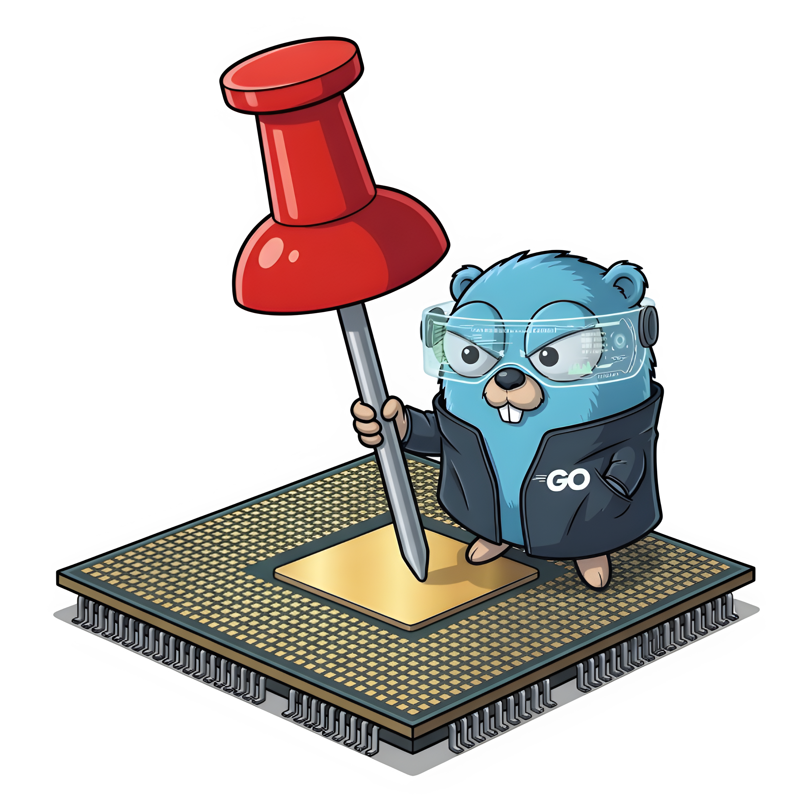

[](LICENSE)


GOSET : Efficient IRQ task pinning
============================================



Goset is a systematic CPU-pinning CLI tool.
It takes a task, single|multi threaded, ranks cores by interrupt rate and scheduler noise, isolates the task, steers future interrupts and reports kernel and hardware counters for the run.

* **Noise-aware:** Ranks CPUs by IRQ rate and scheduler load before pinning.
* **Isolated:** cgroup v2 + IRQ steering, for exclusive CPU access.
* **Telemetry built in:** IRQ, throttle, ctxsw counts, ...; reported with the run.
* **No IPI:** Housekeeper thread reads every CPU's counters remotely, from kernel-maintained state.
* **Diagnostics:** Reports topology, environment, existing cgroups.

Table of Contents
-----------------

* [Quick Start](#quick-start)
* [Technical insights](#documentation)
* [Performance results](#performance-results)
* [Contributing](CONTRIBUTING.md)
* [AI Policy](AGENTS.md)
* [License](LICENSE)


Quick Start
-----------

Goset needs sudo only for `-cgroup` and `-steer`.

| flag | type | default | description | rule |
|---|---|---|---|---|
| ` -- ` |string| | Separating Goset flags and task | |
| `-n` |int| 1 | How many threads to book | n>=1 |
| `-cgroup` |bool| false | Containerize task inside Cgroupv2. Required for N>1 | **sudo** |
| `-steer` |bool| false | Push away steerable IRQs, automatically handle IRQBalance | **sudo** |
| `-interval` |int| 100 | Poll interval in milliseconds for telemetry collection | |
| `-include` |string| | List of threads to select first, handles ranges (e.g.: `1,3-5` -> 1,3,4,5)| |
| `-exclude` |string| | List of threads to avoid, handles ranges (e.g.: `1,3-5` -> 1,3,4,5) | |
| `-numa` |int| -2 | Constrain the task cpus and memory to one node: 0..N that node only, -1:Auto (widest node), -2:Off (multi node). A node that cannot fill `-n` is an error. | |

> Multi-thread tasks: linux `sched_setaffinity` can't pin multithreaded tasks, for this reason `-cgroup` is needed.


Goset has a second form called `Diagnostic`, callable with bare `goset`.

| flag | description | rule |
|---|---|---|
| *bare* | Report Topology, CPU state, cgroups.. | | 
| `-rm-cgroup` | Let you **brut-force delete** an existing group. In case of non-identified goset bug | **sudo** |

> Identifying Goset's cgroup: name is "goset-" + the task binary's basename (e.g. task: `./mybench arg1, arg2` -> cgroup name: `goset-mybench`).

> Concurrent runs: each cgroup name and IRQ steering are guarded by a lock under `/run/lock`. A second run that would reuse the same cgroup or steer at the same time fails immediately and reports the holder pid.

**Real usage**:
```bash
# Diagnose: topology, environment, existing cgroups.
goset

# Pin to one quiet CPU ('-n 1' under the hood)
goset -- ./task

# Full isolation: exclusive CPU, IRQ steered away.
sudo goset -n 1 -cgroup -steer -- ./mybench

# Build STREAM.c, goset's own bundled benchmark
cp benchmark/stream/stream.c.tmpl /tmp/stream.c
cc -O2 -o /tmp/stream /tmp/stream.c

# Pin it, full isolation
sudo goset -n 1 -cgroup -steer -- /tmp/stream 20000000 50

# Multi-thread task. -cgroup is required at n>1
sudo goset -n 4 -cgroup -- ./mybench -threads 4

# Force selection onto specific CPUs
goset -include 2,4-6 -- ./mybench

# Keep selection off specific CPUs
goset -exclude 0,1 -- ./mybench

# Constrain selection to one NUMA node
goset -numa 0 -- ./mybench

# Change the telemetry sampling window (ms).
goset -interval 500 -- ./mybench

# Remove a cgroup goset left behind (incase of bug)
sudo goset -rm-cgroup goset-mybench
```

**Output**:

Goset output format (with `-steer` and `-cgroup`):
```
----------------- GOSET -----------------
Selection
  cpu  sel  steerable  non-steerable  sibl  isol  numa  nohz  rcu
    8   *           0            412   600           0
    6   *           0            485   500           0
   10   *           0            492   602           0
    0   *           0            500   485           0
    2              94            506   412           0
    1   &           0            508   701           0
   11               5            539   822           0
    5             275            547   544           0
    4               9            593   492           0
    9               0            609   747           0
    7               0            701   508           0
    3               0            747   609           0

Telemetry
  cpu  freq min  freq avg  freq max  irq steerable  irq non-steerable
  0     2.99GHz   3.01GHz   3.88GHz              0              1.50k
  6     2.99GHz   3.00GHz   3.49GHz              0                108
  8     2.99GHz   3.01GHz   4.83GHz              0                154
  10    2.99GHz   3.06GHz   5.00GHz              2                330
  all   2.99GHz   3.02GHz   5.00GHz              2              2.10k

Run
  task   wall             10.00s  exit               0   samples     100@100ms
  sched  ctxsw voluntary  2       ctxsw involuntary  0   migrations  0
         run_delay        0ns
  steer  applied          40      rejected           26  remaining   0
         drift            0       irqbalance held    no

  not reported: throttle
```


* `sel`: `*` marks the pinned CPU, `&` marks the housekeeper.
* `steerable` / `non-steerable`: interrupts counted on that CPU while ranking: device IRQs goset can steer away, and kernel-owned rows (NMI, LOC, RES) it cannot.
* `sibl`: sibling core's scheduler load, used to rank CPUs.
* `Telemetry`: per-CPU counters sampled during the run, one row per counter source.
* `Global`: steer/cgroup/ctxsw summary and the task's own wall time and exit code.


Technical insights
-------------

**Selection** (`internal/cpu/bench.go`)
- Rank input: IRQ delta (500ms sample) + sibling runqueue load.
- Lowest noise: booked for the task and the next lowest become housekeeper.
- Housekeeper avoids the task's core and its SMT sibling.

**Isolation**
| mode | mechanism | scope |
|---|---|---|
| default | `sched_setaffinity` | 1 thread |
| `-cgroup` | cgroupv2 cpuset, placed at clone (`CLONE_INTO_CGROUP`) | N threads |

`-n>1` requires `-cgroup`. Affinity alone can't hold a process tree.

**IRQ steering** (`-steer`)
- Holds `irqbalance` for the run: stops the systemd unit, restarts it on exit.
- Unmanaged daemon (no systemd): warns and steers anyway.
- Writes `/proc/irq/*/smp_affinity_list` for IRQs on selected CPUs.
- Restores prior affinity on exit.

**Telemetry**
- Reader: Only the housekeeper reads.
- No IPI: every counter comes from procfs/sysfs. The pinned housekeeper thread does the mid-run poll; the before/after baseline runs on the calling thread.
- Source: kernel software counters only: `/proc/interrupts`, sysfs throttle, `wait4()` rusage...
- `-interval`: mid-run poll tick, ms. Not used by `SelectCPUs()`.


Performance results
--------------------

COMING SOON

